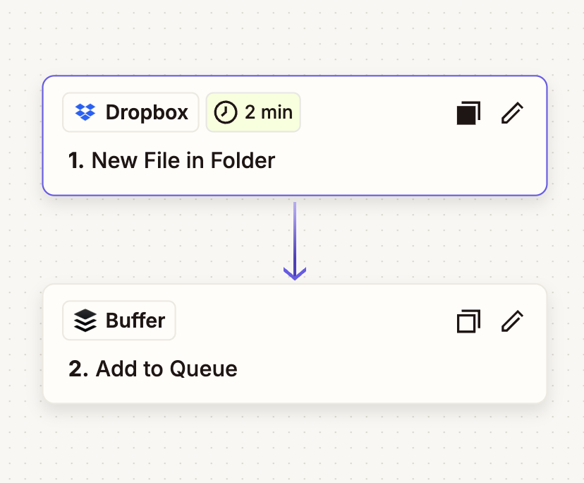

# TokBot

A comprehensive Python tool for automating content creation and distribution. TokBot fetches viral Reddit posts, generates audio narration, creates formatted images, compiles videos with subtitles, and uploads content to TikTok.

## Features

- **Reddit Content Extraction**: Fetch viral posts from multiple subreddits with advanced filtering
- **Audio Generation**: Convert Reddit post text to speech using Cartesia TTS API
- **Image Generation**: Create formatted images with Reddit post titles and subreddit names
- **Video Compilation**: Compile videos with background footage, audio, and text overlays
- **Subtitle Generation**: Generate and overlay subtitles with dynamic positioning
- **Dropbox Upload**: Automatically upload final videos to Dropbox for storage and distribution
- **Zapier Integration**: Seamless integration with Buffer for automated social media scheduling
- **Google Sheets Logging**: Track processed posts and their performance metrics
- **Flexible Configuration**: Environment-based configuration for all API keys and settings

## Setup

### 1. Install Dependencies

```bash
pip install -r requirements.txt
```

### 2. Environment Configuration

Create a `.env` file in the project root with your API credentials:

```env
# Reddit API Configuration
REDDIT_CLIENT_ID=your_reddit_client_id_here
REDDIT_CLIENT_SECRET=your_reddit_client_secret_here

# TikTok Configuration
TIKTOK_SESSION_ID=your_tiktok_session_id_here

# Cartesia TTS API Configuration
CARTESIA_API_KEY=your_cartesia_api_key_here
CARTESIA_VOICE_ID=your_cartesia_voice_id_here

# Dropbox Configuration
DROPBOX_ACCESS_TOKEN=your_dropbox_access_token_here
DROPBOX_ROOT_FOLDER=your_dropbox_folder_path

# Google Sheets Configuration
GOOGLE_CREDENTIALS_JSON=your_google_service_account_json
GOOGLE_SHEET_ID=your_google_sheet_id_here

# Font Configuration
SUBREDDIT_FONT_PATH="/path/to/your/font.ttf"
TITLE_FONT_PATH="/path/to/your/font.ttf"
SUBTITLE_FONT_PATH="/path/to/your/font.ttf"

# Content Generation Settings
VIRAL_POST_LIMIT=25
VIRAL_MIN_SCORE=100
VIRAL_MIN_RATIO=0.8
VIRAL_MIN_COMMENTS=10
VIRAL_TIME_FILTER=day
VIRAL_MIN_BODY_LENGTH=100
VIRAL_MAX_BODY_LENGTH=1000
STORYTELLING_SUBREDDITS=tifu,AmItheAsshole,relationship_advice,MaliciousCompliance,entitledparents
```

### 3. Reddit API Setup

1. Go to https://www.reddit.com/prefs/apps
2. Click "Create App" or "Create Another App"
3. Fill in the details:
   - **Name**: Your app name (e.g., "TokBot")
   - **Type**: Select "script"
   - **Description**: Optional description
   - **About URL**: Can be left blank
   - **Redirect URI**: Use `http://localhost:8080`
4. After creating, note down the **Client ID** (under the app name) and **Client Secret**

### 4. TikTok Session ID Setup

To get your TikTok session ID:

1. Log in to your TikTok account
2. Go to https://www.tiktok.com/
3. Press the F12 key on your keyboard
4. Go to Application > Storage > Cookies
5. Find the value of the `sessionid` cookie
6. You should have something like this: `7a9f3c5d8f6e4b2a1c9d8e7f6a5b4c3d`

### 5. Cartesia TTS API Setup

1. Sign up for Cartesia TTS API at https://cartesia.ai/
2. Get your API key and voice ID
3. Add them to your `.env` file

### 6. Dropbox Setup

1. Go to https://www.dropbox.com/developers/apps
2. Create a new app or use an existing one
3. In the app settings, go to the "Permissions" tab
4. Enable the `files.content.write` scope for file uploads
5. Generate an access token in the "Settings" tab
6. Add the token and your desired folder path to your `.env` file

### 7. Google Sheets Setup

1. Create a Google Cloud Project
2. Enable Google Sheets API
3. Create a service account and download the JSON credentials
4. Share your Google Sheet with the service account email
5. Add the credentials JSON and sheet ID to your `.env` file

### 8. Font Setup

1. Download your preferred fonts (TTF format)
2. Update the font paths in your `.env` file
3. Recommended fonts: Poppins, Roboto, or similar modern fonts

### 9. Zapier Integration Setup

TokBot integrates with Zapier to automatically schedule content on Buffer when new videos are uploaded to Dropbox. The workflow is:

1. **Dropbox Trigger**: New file uploaded to your specified Dropbox folder
2. **Buffer Action**: Automatically adds the video to your Buffer queue for scheduling



To set up this integration:
1. Create a Zapier account at https://zapier.com/
2. Create a new Zap with Dropbox as the trigger (New File in Folder)
3. Connect Buffer as the action (Add to Queue)
4. Configure the integration to monitor your Dropbox folder
5. Test and activate the Zap

## Usage

### Complete Workflow

```python
from generators.redditGenerator import RedditGenerator

# Initialize the generator
generator = RedditGenerator()

# This will:
# 1. Fetch viral Reddit posts
# 2. Generate audio narration
# 3. Create formatted images
# 4. Compile videos with subtitles
# 5. Log to Google Sheets
generator.fetch_reddit_posts()
```

### Video Compilation with Subtitles

```python
from helpers.video.subtitleGenerator import add_subtitles

# Add subtitles to a compiled video
add_subtitles(
    file_path="output-1mhu024",  # Folder containing video files
    output_path="output/compiled_with_subtitles.mp4",
    max_words=5,  # Max words per subtitle group
    max_gap=0.5,  # Max gap between subtitles to group them
    initial_position_duration=5.0  # Seconds before subtitles move to center
)
```

### Basic Dropbox Upload

```python
from helpers.uploaders.dropboxUploader import DropboxUploader
import os
from dotenv import load_dotenv

load_dotenv()

uploader = DropboxUploader()
uploader.upload_file("path/to/your/video.mp4", "video.mp4")
```

### Basic TikTok Upload

```python
from helpers.tiktokUploader import uploadVideo
import os
from dotenv import load_dotenv

load_dotenv()

uploadVideo(
    session_id=os.getenv("TIKTOK_SESSION_ID"),
    video_path="path/to/your/video.mp4",
    title="Your Video Title",
    tags=["tiktok", "funny", "viral"],
    schedule_time=0,  # 0 for immediate upload
)
```

### Running the Main Application

```bash
python main.py
```

## Project Structure

```
TokBot/
├── generators/
│   ├── __init__.py
│   └── redditGenerator.py          # Main content generation logic
├── helpers/
│   ├── __init__.py
│   ├── audioHandler.py            # TTS audio generation
│   ├── uploaders/
│   │   ├── dropboxUploader.py     # Dropbox upload functionality
│   │   └── sheetsLogger.py        # Google Sheets logging
│   ├── reddit/
│   │   ├── formatRedditpost.py    # Image generation with templates
│   │   └── redditFetcher.py       # Reddit API integration
│   ├── video/
│   │   ├── audioHandler.py        # Audio processing
│   │   ├── footageFetcher.py      # YouTube footage downloading
│   │   ├── subtitleGenerator.py   # Subtitle generation and overlay
│   │   └── videoEditor.py         # Video compilation
│   ├── tiktokUploader.py          # TikTok upload functionality
│   └── youtubeFetcher.py          # YouTube integration
├── public/
│   ├── redditTemplate.png         # Image template for Reddit posts
│   └── zapier-workflow.png        # Zapier workflow diagram
├── main.py                        # Main application entry point
├── requirements.txt               # Python dependencies
└── README.md
```

## Complete Workflow

### 1. Content Discovery
- Fetches viral posts from configured subreddits
- Applies comprehensive filtering (score, ratio, comments, body length)
- Tracks used posts to avoid duplicates

### 2. Content Processing
- **Audio Generation**: Converts post text to speech using Cartesia TTS
- **Image Creation**: Generates formatted images with post title and subreddit
- **Footage Download**: Downloads background footage from YouTube
- **Video Compilation**: Combines audio, image, and footage into final video

### 3. Subtitle Generation
- **SRT Creation**: Generates subtitle files from audio timestamps
- **Subtitle Grouping**: Groups short subtitles for better readability
- **Dynamic Positioning**: Subtitles start in bottom position, then move to center
- **Styling**: Rounded rectangle background with custom fonts

### 4. Distribution
- **Google Sheets Logging**: Records all processed posts with metadata
- **Dropbox Upload**: Uploads final videos to cloud storage
- **Zapier Integration**: Automatically schedules content via Buffer

## API Reference

### RedditPostExtractor Class

#### Methods

- `get_posts(subreddit, limit=25, time_filter='day')`: Fetch posts from a subreddit
- `get_top_posts_by_rating(subreddit, limit=25, min_score=100, min_ratio=0.8, min_comments=10)`: Get posts with comprehensive filtering
- `filter_posts_by_score(posts, min_score=0, max_score=None)`: Filter by post score
- `filter_posts_by_ratio(posts, min_ratio=0.0)`: Filter by upvote ratio
- `filter_posts_by_comments(posts, min_comments=0)`: Filter by comment count
- `filter_posts_by_body_length(posts, min_length=100, max_length=1000)`: Filter by post length
- `filter_used_posts(posts)`: Filter out already processed posts
- `print_posts_summary(posts)`: Display formatted post information

### ImageGenerator Class

#### Methods

- `add_text_to_image(subreddit, post_title, output_path)`: Create formatted images with Reddit content
- `load_template()`: Load the template image for formatting
- `_draw_wrapped_text()`: Draw text with word wrapping

### VoiceGenerator Class

#### Methods

- `generate_audio(transcript, output_path)`: Convert text to speech using Cartesia TTS
- `generate_srt_from_timestamps(timestamps_list, output_path)`: Generate SRT subtitle files

### VideoCompiler Class

#### Methods

- `compile_video()`: Compile final video with audio, image, and footage
- `fetch_footage()`: Download background footage from YouTube
- `get_wav_duration()`: Get audio duration for video timing
- `calculate_pic_duration(input_file_path)`: Calculate image display duration based on text length

### SubtitleGenerator

#### Functions

- `add_subtitles(file_path, output_path, max_words=8, max_gap=1.0, initial_position_duration=0.0)`: Add subtitles to video
- `load_srt(file_path)`: Load and parse SRT subtitle files
- `group_subtitles(subs, max_words=8, max_gap=1.0)`: Group short subtitles together

### Dropbox Uploader

#### Methods

- `upload_file(file_path, file_name)`: Upload a single file to Dropbox
- `batch_upload_files(file_paths, file_names)`: Upload multiple files to Dropbox

### TikTok Uploader

#### Functions

- `uploadVideo(session_id, video, title, tags, schedule_time=0)`: Upload video to TikTok

## Configuration Options

### Content Filtering

- `VIRAL_POST_LIMIT`: Number of posts to fetch per subreddit
- `VIRAL_MIN_SCORE`: Minimum Reddit score threshold
- `VIRAL_MIN_RATIO`: Minimum upvote ratio (0.0 to 1.0)
- `VIRAL_MIN_COMMENTS`: Minimum comment count
- `VIRAL_TIME_FILTER`: Time period for posts ('hour', 'day', 'week', 'month', 'year', 'all')
- `VIRAL_MIN_BODY_LENGTH`: Minimum post text length
- `VIRAL_MAX_BODY_LENGTH`: Maximum post text length
- `STORYTELLING_SUBREDDITS`: Comma-separated list of subreddits to monitor

### Subtitle Configuration

- `max_words`: Maximum words per subtitle group (default: 8)
- `max_gap`: Maximum time gap to group subtitles (default: 1.0 seconds)
- `initial_position_duration`: Seconds before subtitles move to center (default: 0.0)

### Font Configuration

- `SUBREDDIT_FONT_PATH`: Path to font for subreddit text
- `TITLE_FONT_PATH`: Path to font for post titles
- `SUBTITLE_FONT_PATH`: Path to font for subtitles

## Error Handling

The application includes comprehensive error handling for:
- Missing environment variables
- API authentication failures
- Network request errors
- File processing errors
- Video compilation errors
- Subtitle generation errors
- TikTok upload failures

## Rate Limiting

All APIs (Reddit, TikTok, Cartesia, YouTube) have rate limits. The application respects these limits and includes appropriate error handling.

## Dependencies

- `requests>=2.31.0`: HTTP requests
- `python-dotenv>=1.0.0`: Environment variable management
- `Pillow>=10.0.0`: Image processing
- `sseclient-py>=1.7.2`: Server-sent events for TTS streaming
- `dropbox>=11.36.0`: Dropbox API integration
- `gspread>=5.12.0`: Google Sheets API integration
- `google-auth>=2.23.0`: Google authentication
- `moviepy>=1.0.3`: Video editing and compilation
- `yt-dlp>=2023.7.6`: YouTube video downloading
- `ffmpeg-python>=0.2.0`: Video processing
- `opencv-python>=4.8.0`: Computer vision and image processing
- `numpy>=1.24.0`: Numerical computing
- `tqdm>=4.65.0`: Progress bars

## License

This project is open source and available under the MIT License.
